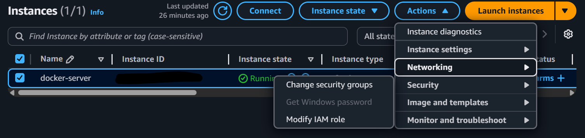
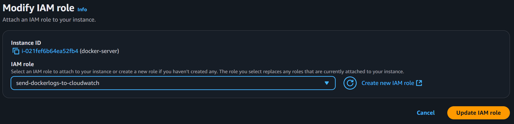
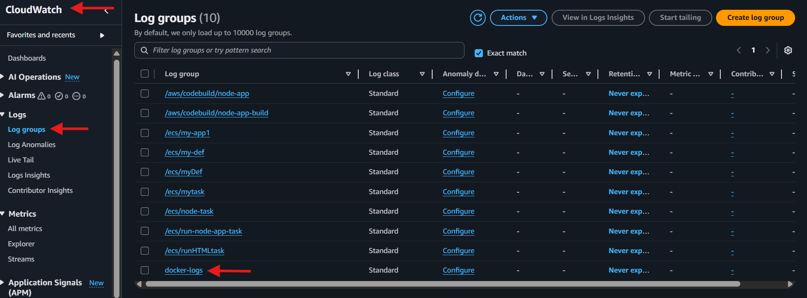
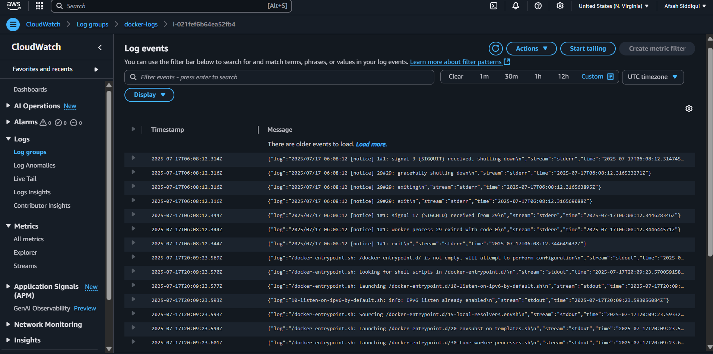

# Integrating Docker Container Logs with AWS CloudWatch

In this lab, we will be monitoring Docker container running within AWS EC2 server via AWS CloudWatch

### Prerequisites

- Have docker installed on your EC2 server

### Steps to Follow
- Run a Docker container e.g. " docker run -d --name my-container -p 80:80 nginx"
- Download the CloudWatch agent package in your EC2 server "wget https://s3.amazonaws.com/amazoncloudwatch-agent/ubuntu/amd64/latest/amazon-cloudwatch-agent.deb"
- Install the CloudWatch agent "sudo dpkg -i amazon-cloudwatch-agent.deb"
- Check the version of cloudwatch agent to confirm the installation "/opt/aws/amazon-cloudwatch-agent/bin/amazon-cloudwatch-agent --version"
- Create a configuration file to link docker logs to cloudwatch log group. [see file content](files/config-docker-awscloudwatch.json)
- Give your EC2 instance the permission to send logs to CloudWatch
  On AWS console, navigate to EC2 instances and select the EC2 instance you're working on. Then select "Actions"->"Security"->"Modify IAM role"

  
  
- Select "Create new IAM role"
- Click on "New role"
- Select "AWS Service" for trusted entity type and "EC2" for "service or use case"
- Click Next
- Search for CloudWatch logs full access, select the permission -> Next
- Type in the name for this role (e.g. send-dockerlogs-to-cloudwatch" and then create role
- Now on the Modify IAM role page/tab, select the newly created role from dropdown menu
  
  

- and select update IAM role
- Back to the EC2 terminal: start the CloudWatch agent "sudo /opt/aws/amazon-cloudwatch-agent/bin/amazon-cloudwatch-agent-ctl -a fetch-config -m ec2 -c file:config-cloudwatch.json -s". 
  Note: make sure to rename the config file name in above command to the name you've saved your config file with
- Verify that the CloudWatch agent is running "sudo /opt/aws/amazon-cloudwatch-agent/bin/amazon-cloudwatch-agent-ctl -m ec2 -a status"
- Now on AWS console, open CloudWatch -> Select Log groups -> Locate "docker-logs"

  

- Select docker-logs -> Select the log stream at the bottom of the page -> You'll see the docker logs on AwS CloudWatch
  

### Cleanup
(Optional, but useful if you don't want to spend extra bucks)

- Stop the cloudwatch agent "sudo /opt/aws/amazon-cloudwatch-agent/bin/amazon-cloudwatch-agent-ctl -a stop -m ec2"
- Check the agent status "sudo /opt/aws/amazon-cloudwatch-agent/bin/amazon-cloudwatch-agent-ctl -m ec2 -a status"
- Uninstall aws cloudwatch agent "sudo dpkg --purge amazon-cloudwatch-agent"
- Delete the log group from CloudWatch
