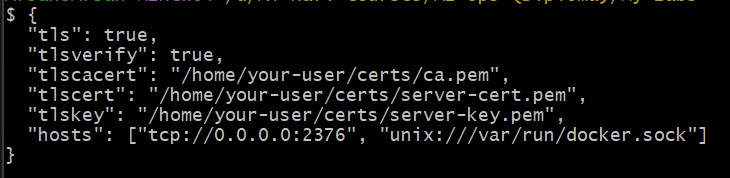

# Securing Docker

We will enable TLS encryption between client and Docker daemon for a secure connection. And implement AWS Identity and Access Management for ECS tasks to provide enhanced security.

### Generating TLS certificates to secure the Docker daemon so it only accepts verified client connections over HTTPS

- Create a new folder "certs" in your home directory: "mkdir -pv ~/certs"  
- cd ~/certs
- Create a 4096-bit private key for the Certificate Authority (CA): "openssl genrsa -out ca-key.pem 4096"  
- Create a self-signed certificate (ca.pem) valid for 1 year: "openssl req -new -x509 -days 365 -key ca-key.pem -sha256 -out ca.pem"  
- Generate a private key for the Docker server: "openssl genrsa -out server-key.pem 4096"  
- Create a CSR (Certificate Signing Request) for the server using the private key: "openssl req -subj "/CN=$HOST" -sha256 -new -key server-key.pem -out server.csr"
- Sign the server’s CSR with the CA’s private key: "openssl x509 -req -days 365 -sha256 -in server.csr -CA ca.pem -CAkey ca-key.pem -CAcreateserial -out server-cert.pem"
- Generate a 4096-bit private key for the client: "openssl genrsa -out client-key.pem 4096"
- Create a CSR for the client certificate: "openssl req -subj '/CN=client' -new -key client-key.pem -out client.csr"
- Sign the client certificate using the CA: "openssl x509 -req -days 365 -sha256 -in client.csr -CA ca.pem -CAkey ca-key.pem -CAcreateserial -out client-cert.pem"
- Start docker with TLS enabled: "dockerd --tlsverify --tlscacert=ca.pem --tlscert=server-cert.pem --tlskey=server-key.pem -H=0.0.0.0:2376"
- Docker now has a secure connection, and listens on port 2376

### Start docker automatically with TLS

- Edit the docker daemon config file: "sudo nano /etc/docker/daemon.json"
- Add these lines in the file:

   

- Restart docker "sudo systemctl restart docker"

